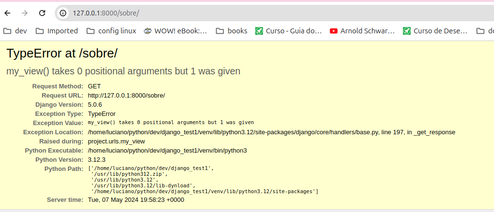
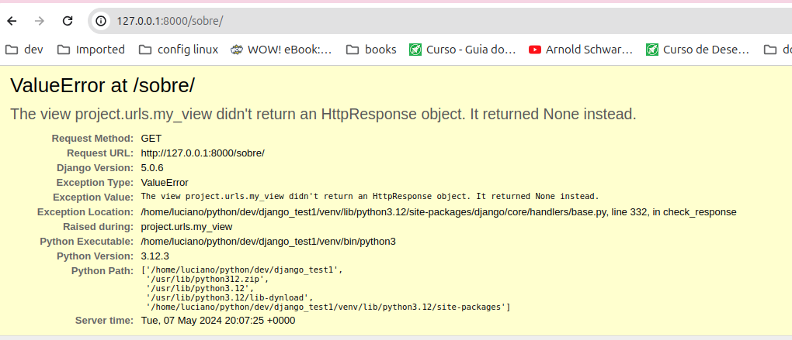

# Autor: L Palharês Rosa

# Desenvolvimento de projeto novo em django


### 1 - iniciar projecto django:

```
django-admin startproject project .
```

### 2 - abrir projeto na url

```
python3 manage.py runserver
```

## Criar endpoint /sobre sem passar request:

```
mesmo sem passar parametro no metodo, automaticamente o codigo passa
o que faz ocorrer erro, pois meu metodo nao requer parametro
``` 



## O endpoint /sobre tem request mas nao tem response:




